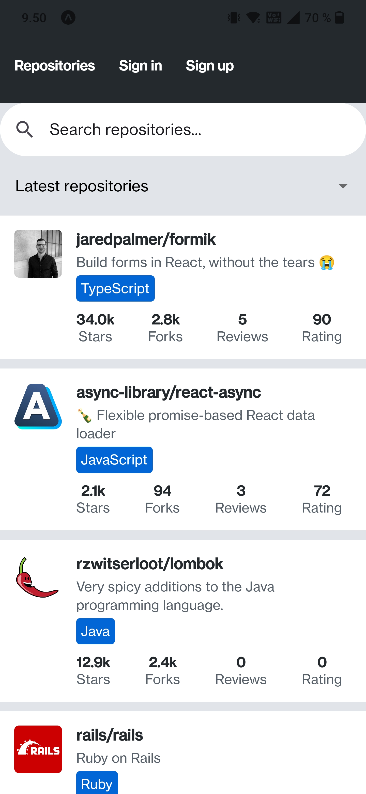
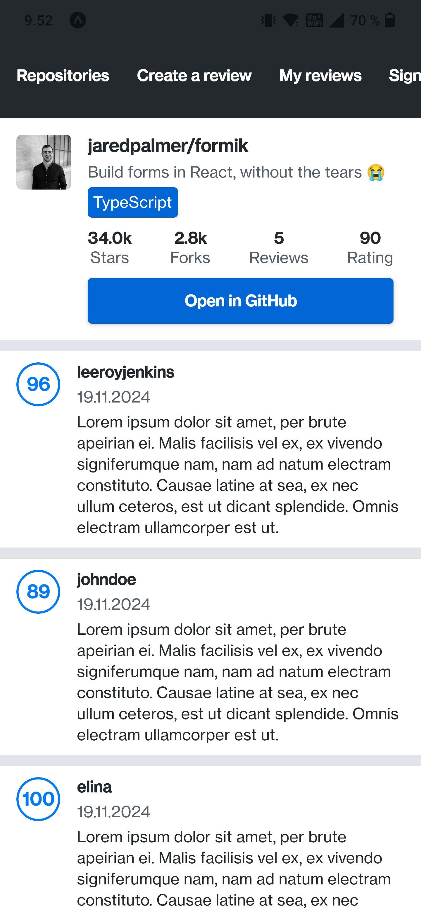
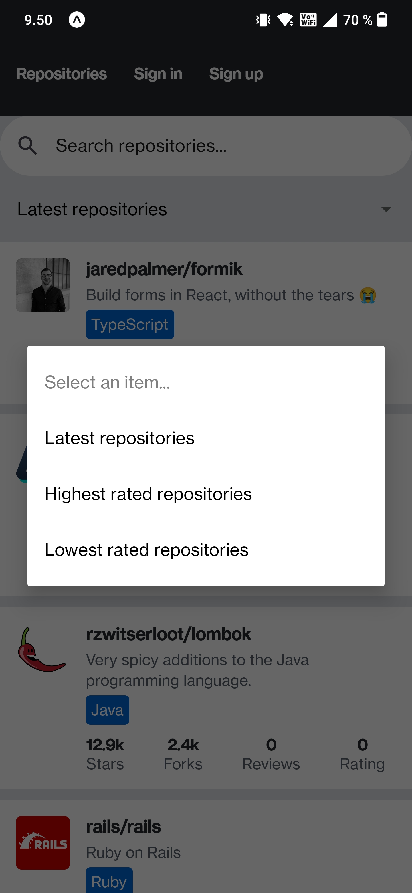
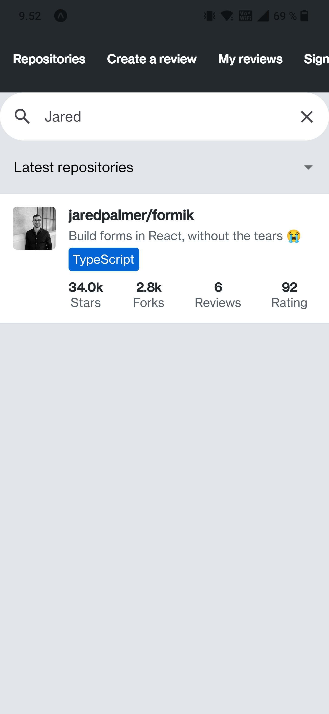
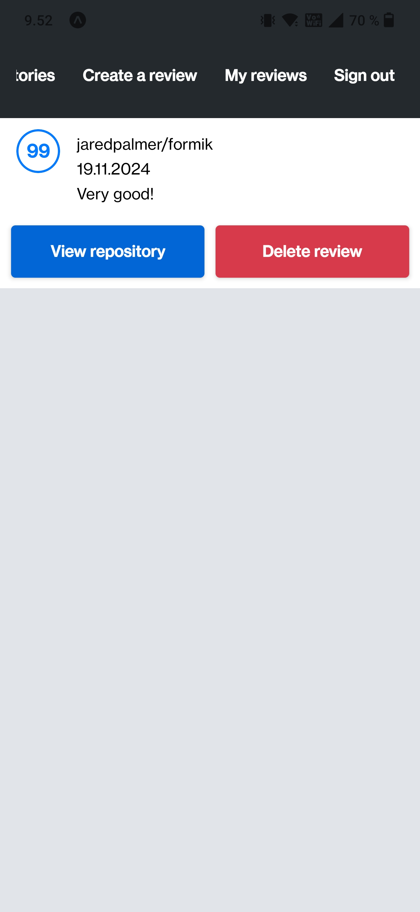
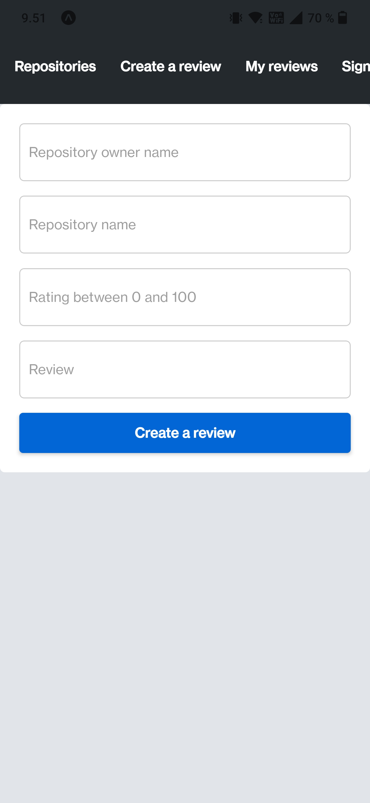

# Submission repository for University of Helsinki Full stack open course part 10
- https://fullstackopen.com/en/part10

## Screenshots

#### Repositories & single repository views
<kbd></kbd>
<kbd></kbd>

#### Repository filtering & search
<kbd></kbd>
<kbd></kbd>

#### Reviews page & rate repository form
<kbd></kbd>
<kbd></kbd>